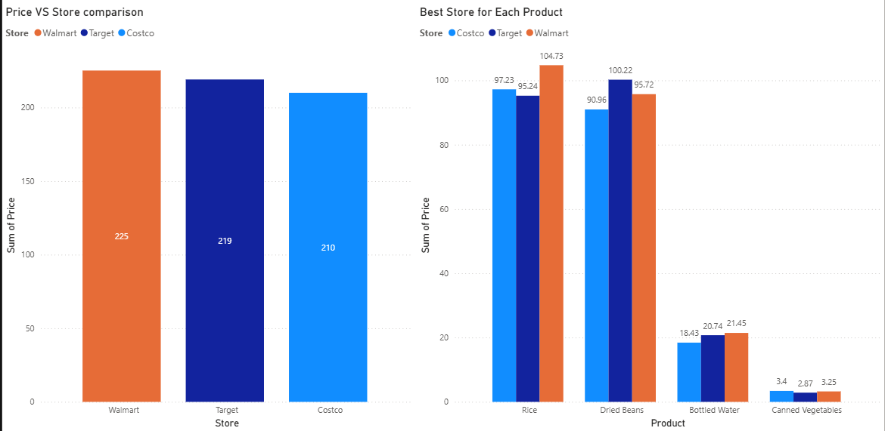

# 01 — Installation & Setup

## What is Power BI?

Power BI is a Microsoft business intelligence tool used to connect to data sources, transform data, build models, and create interactive dashboards and reports.

**Three main components:**
- **Power BI Desktop** — the authoring tool (Windows app, free)
- **Power BI Service** — cloud platform for publishing and sharing (web)
- **Power BI Mobile** — view reports on phone/tablet

> For this learning journey, we'll primarily use **Power BI Desktop**.

---

## Installation

**Requirements:**
- Windows 10/11 (64-bit)
- .NET Framework 4.7.2 or later
- At least 2 GB RAM (4 GB recommended)

**Steps:**
1. Go to [https://powerbi.microsoft.com](https://powerbi.microsoft.com)
2. Click **Products → Power BI Desktop**
3. Click **Download free** — this redirects to the Microsoft Store
4. Install from the Store (recommended), OR download the `.msi` installer directly from the Download Center for more control

> **Tip:** The Microsoft Store version auto-updates. The `.msi` version requires manual updates but is better for corporate environments.

---

## First Launch

When you open Power BI Desktop for the first time:

- A **splash screen / sign-in dialog** appears — you can skip signing in for now
- The main interface loads with three views on the left panel:

| Icon | View | Purpose |
|------|------|---------|
| 📊 | **Report View** | Build visuals and dashboards |
| 🗃️ | **Table View** | Inspect your data in tabular form |
| 🔗 | **Model View** | Define relationships between tables |

---

## Interface Overview

```
┌─────────────────────────────────────────────────┐
│  Ribbon (Home / Insert / Modeling / View / ...)  │
├────┬────────────────────────────┬────────────────┤
│    │                            │  Visualizations│
│ V  │                            │  pane          │
│ i  │     Canvas (Report View)   │                │
│ e  │                            │  Fields pane   │
│ w  │                            │                │
│ s  │                            │  Filters pane  │
└────┴────────────────────────────┴────────────────┘
```

**Key panels:**
- **Ribbon** — all major actions (Get Data, Transform, New Measure, etc.)
- **Canvas** — where you build your report pages
- **Visualizations pane** — chart types and formatting options
- **Fields pane** — your loaded tables and columns
- **Filters pane** — report/page/visual-level filters

---

## Connecting to Your First Data Source

1. Click **Home → Get Data**
2. Choose a source — for beginners, start with **Excel** or **CSV**
3. Navigate to your file → click **Open**
4. The **Navigator** window shows available tables/sheets — check the ones you want
5. Click **Load** (direct load) or **Transform Data** (opens Power Query for cleaning)

> **Best practice:** Always click **Transform Data** first so you can inspect and clean before loading.

---

## Saving Your Work

Power BI files are saved as `.pbix` files.

- **Ctrl + S** to save
- `.pbix` files contain everything: data model, queries, report layout, and visuals
- Keep your `.pbix` files in version control (this repo!) for tracking progress

---

## First Visualization

After loading data, creating a visual is three steps:

1. Click on an empty area of the canvas
2. Select a chart type from the **Visualizations pane**
3. Drag fields from the **Fields pane** into the chart's field wells (Axis, Values, Legend, etc.)



---

## Key Takeaways

- [ ] Power BI Desktop is free and Windows-only
- [ ] Three views: Report, Table, Model
- [ ] Always inspect data in Power Query before loading
- [ ] Files saved as `.pbix`
- [ ] Visuals are built by dragging fields onto a canvas

---

## Resources

- [Official Power BI Documentation](https://learn.microsoft.com/en-us/power-bi/)
- [Microsoft Learn — Power BI Learning Path](https://learn.microsoft.com/en-us/training/powerplatform/power-bi)
- [Guy in a Cube (YouTube)](https://www.youtube.com/@GuyInACube) — highly recommended channel
- [Alex the Analyst (YouTube)](# 01 — Installation & Setup

## What is Power BI?

Power BI is a Microsoft business intelligence tool used to connect to data sources, transform data, build models, and create interactive dashboards and reports.

**Three main components:**
- **Power BI Desktop** — the authoring tool (Windows app, free)
- **Power BI Service** — cloud platform for publishing and sharing (web)
- **Power BI Mobile** — view reports on phone/tablet

> For this learning journey, we'll primarily use **Power BI Desktop**.

---

## Installation

**Requirements:**
- Windows 10/11 (64-bit)
- .NET Framework 4.7.2 or later
- At least 2 GB RAM (4 GB recommended)

**Steps:**
1. Go to [https://powerbi.microsoft.com](https://powerbi.microsoft.com)
2. Click **Products → Power BI Desktop**
3. Click **Download free** — this redirects to the Microsoft Store
4. Install from the Store (recommended), OR download the `.msi` installer directly from the Download Center for more control

> **Tip:** The Microsoft Store version auto-updates. The `.msi` version requires manual updates but is better for corporate environments.

---

## First Launch

When you open Power BI Desktop for the first time:

- A **splash screen / sign-in dialog** appears — you can skip signing in for now
- The main interface loads with three views on the left panel:

| Icon | View | Purpose |
|------|------|---------|
| 📊 | **Report View** | Build visuals and dashboards |
| 🗃️ | **Table View** | Inspect your data in tabular form |
| 🔗 | **Model View** | Define relationships between tables |

---

## Interface Overview

```
┌─────────────────────────────────────────────────┐
│  Ribbon (Home / Insert / Modeling / View / ...)  │
├────┬────────────────────────────┬────────────────┤
│    │                            │  Visualizations│
│ V  │                            │  pane          │
│ i  │     Canvas (Report View)   │                │
│ e  │                            │  Fields pane   │
│ w  │                            │                │
│ s  │                            │  Filters pane  │
└────┴────────────────────────────┴────────────────┘
```

**Key panels:**
- **Ribbon** — all major actions (Get Data, Transform, New Measure, etc.)
- **Canvas** — where you build your report pages
- **Visualizations pane** — chart types and formatting options
- **Fields pane** — your loaded tables and columns
- **Filters pane** — report/page/visual-level filters

---

## Connecting to Your First Data Source

1. Click **Home → Get Data**
2. Choose a source — for beginners, start with **Excel** or **CSV**
3. Navigate to your file → click **Open**
4. The **Navigator** window shows available tables/sheets — check the ones you want
5. Click **Load** (direct load) or **Transform Data** (opens Power Query for cleaning)

> **Best practice:** Always click **Transform Data** first so you can inspect and clean before loading.

---

## Saving Your Work

Power BI files are saved as `.pbix` files.

- **Ctrl + S** to save
- `.pbix` files contain everything: data model, queries, report layout, and visuals
- Keep your `.pbix` files in version control (this repo!) for tracking progress

---

## First Visualization

After loading data, creating a visual is three steps:

1. Click on an empty area of the canvas
2. Select a chart type from the **Visualizations pane**
3. Drag fields from the **Fields pane** into the chart's field wells (Axis, Values, Legend, etc.)


---

## Key Takeaways

- [ ] Power BI Desktop is free and Windows-only
- [ ] Three views: Report, Table, Model
- [ ] Always inspect data in Power Query before loading
- [ ] Files saved as `.pbix`
- [ ] Visuals are built by dragging fields onto a canvas

---

## Resources

- [Official Power BI Documentation](https://learn.microsoft.com/en-us/power-bi/)
- [Microsoft Learn — Power BI Learning Path](https://learn.microsoft.com/en-us/training/powerplatform/power-bi)
- [Guy in a Cube (YouTube)](https://www.youtube.com/@GuyInACube) — highly recommended channel)
- [Alex the Analyst (YouTube)](https://www.youtube.com/playlist?list=PLUaB-1hjhk8FE_XZ87vPPSfHqb6OcM0cF) - Playlist i am following 
