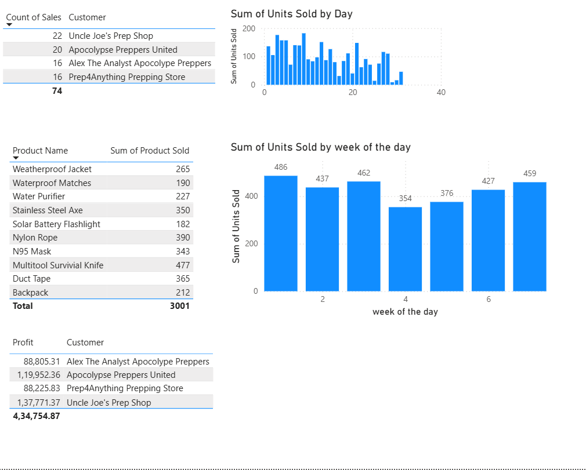

# 04 — DAX (Data Analysis Expressions)

## What is DAX?

DAX is the formula language used in Power BI to create **calculated columns**, **measures**, and **tables**. It looks similar to Excel formulas but is designed for relational data and works across entire tables, not just single cells.

---

## Calculated Columns vs Measures

| | Calculated Column | Measure |
|---|---|---|
| **Evaluated** | Row by row | At query time (based on filter context) |
| **Stored** | In the table (increases file size) | Not stored, computed on the fly |
| **Used for** | Row-level logic, categorization | Aggregations shown in visuals |
| **Visible in** | Table/Model view | Fields pane with a calculator icon |

> **Rule of thumb:** If you need a new column to slice/filter by → Calculated Column. If you need a number to display in a visual → Measure.

---

## Dataset

Same Apocalypse dataset extended with new DAX columns and measures:

**`Apocolypse Sales` table:**
- `Cust ID`, `Customer`, `Date Purchased`, `Order ID`, `Product ID`, `Units Sold` — original columns
- `Order_size` — new calculated column
- `week of the day` — new calculated column
- `Count of Sales` — new measure
- `Sum of Product Sold` — new measure

**`Apocolypse Store` table:**
- `Price`, `Product ID`, `Product Name`, `Production Cost` — original columns
- `Profit` — new measure
- `Profit_column_sumX` — new SUMX measure

---

## DAX Written

### Measures

**Count of Sales**
```dax
Count of Sales = COUNT('Apocolypse Sales'[Order ID])
```
Counts the total number of orders/transactions.

---

**Sum of Product Sold**
```dax
Sum of Product Sold = SUM('Apocolypse Sales'[Units Sold])
```
Adds up all units sold across the filtered context.

---

**Profit**
```dax
Profit = SUM('Apocolypse Store'[Price]) - SUM('Apocolypse Store'[Production Cost])
```
Calculates profit by subtracting production cost from price.

---

**Profit_column_sumX**
```dax
Profit_column_sumX = 
SUMX(
    'Apocolypse Sales',
    'Apocolypse Sales'[Units Sold] * RELATED('Apocolypse Store'[Price])
    - 'Apocolypse Sales'[Units Sold] * RELATED('Apocolypse Store'[Production Cost])
)
```
Uses `SUMX` to iterate row by row over the Sales table and calculate profit per row, then sum it up. More accurate than a simple SUM when you need row-level multiplication.

---

### Calculated Columns

**Order_size**
```dax
Order_size = 
IF(
    'Apocolypse Sales'[Units Sold] <= 20, "Small",
    IF('Apocolypse Sales'[Units Sold] <= 50, "Medium", "Large")
)
```
Categorizes each order into Small / Medium / Large based on units sold.

---

**week of the day**
```dax
week of the day = FORMAT('Apocolypse Sales'[Date Purchased], "dddd")
```
Extracts the day name (Monday, Tuesday, etc.) from the purchase date.

---

## Key DAX Functions Used

| Function | Type | What it does |
|----------|------|-------------|
| `SUM()` | Aggregation | Adds up all values in a column |
| `COUNT()` | Aggregation | Counts rows in a column |
| `SUMX()` | Iterator | Loops row by row, evaluates expression, then sums |
| `RELATED()` | Relationship | Pulls a value from a related table (like a VLOOKUP) |
| `IF()` | Logical | Returns different values based on a condition |
| `FORMAT()` | Text/Date | Converts a value to a formatted text string |

---

## SUMX vs SUM — Key Difference

```
SUM   → adds up an existing column directly
SUMX  → loops through each row, calculates something, then adds up the results
```

Use `SUMX` when your calculation requires **multiplying or combining columns row by row** before summing.

---

## Final Dashboard



---

## Key Takeaways

- [ ] Measures are dynamic — they respond to filters and slicers
- [ ] Calculated columns are static — computed once when data loads
- [ ] Use `SUMX` + `RELATED()` for row-level calculations across related tables
- [ ] `FORMAT()` is useful for extracting readable date parts
- [ ] Always prefer measures over calculated columns for aggregations

---

## Files

| File | Description |
|------|-------------|
| `dax_measures.pbix` | Power BI file with all DAX measures and columns |
| `screenshots/dashboard.png` | Final dashboard screenshot |
