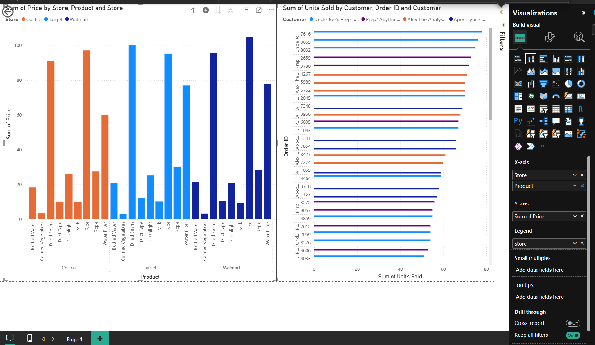

# 05 — Visualizations & Drill Down

## What is Drill Down in Power BI?

Drill Down lets you create a **hierarchy within a visual** so you can move between summary and detail views interactively — without building separate charts.

Instead of showing everything at once, you control the level of detail on demand.

---

## Charts Built

### Left Chart — Sum of Price by Store → Product (Main Focus)



| Field | Value |
|-------|-------|
| X-axis | `Store` → `Product` (hierarchy) |
| Y-axis | `Sum of Price` |
| Legend | `Store` (Costco = orange, Target = light blue, Walmart = dark blue) |

### Right Chart — Sum of Units Sold by Customer → Order ID

| Field | Value |
|-------|-------|
| Y-axis | `Customer` → `Order ID` (hierarchy) |
| X-axis | `Sum of Units Sold` |
| Legend | `Customer` |

---

## How the Hierarchy Was Built (Left Chart)

In the **Visualizations pane → X-axis field well:**

```
X-axis:
  ├── Store      ← Top Level (Level 1)
  └── Product    ← Drill Down Level (Level 2)
```

**Steps taken:**
1. Dragged `Store` into the X-axis field well
2. Dragged `Product` below it — Power BI automatically creates a hierarchy
3. Enabled **Drill Down mode** using the arrow icon on the visual

---

## The Three Drill Actions

### 1.  Drill Down (Single Path)
Click one bar → drops into that store's products only

> Example: Click **Costco** → see only Costco's products (Bottled Water, Canned Vegetables, Dried Beans, etc.)

### 2.  Expand All (Used in screenshot)
Shows **all stores + their products simultaneously**

> This is what the screenshot shows:
> ```
> Costco  → Bottled Water, Canned Vegetables, Dried Beans, Duct Tape, Flashlight, Milk, Rice, Rope, Water Filter
> Target  → Bottled Water, Canned Vegetables, Dried Beans ...
> Walmart → Bottled Water, Canned Vegetables, Dried Beans ...
> ```

### 3.  Drill Up
Goes back to the top-level Store view — summary only

---

## Reading the Expanded Chart

In the expanded view (Level 2), you can compare the **same product across different stores:**

| Observation | Detail |
|-------------|--------|
| Rice at Walmart | Tallest bar (~110) — highest priced |
| Rice at Target | Second highest (~100) |
| Bottled Water | Consistently low price across all stores |
| Legend colors | Orange = Costco, Light Blue = Target, Dark Blue = Walmart |

---

## How to Enable Drill Down Mode

1. Click on the visual to select it
2. Drill icons appear in the **top-left corner** of the visual:

| Icon | Action |
|------|--------|
| `↑` | Drill Up — go back one level |
| `↓` | Toggle Drill Down mode ON/OFF |
| `↓↓` | Expand all — show all items at next level |
| `↗` | Go to next level entirely |

3. When Drill Down mode is **ON**, clicking a bar drills into it instead of filtering the page

---

## Key Takeaways

- [ ] Hierarchies are built by stacking fields in the X-axis (or Y-axis) field well
- [ ] Drill Down mode must be toggled ON before clicking into a bar
- [ ] "Expand All" shows all levels simultaneously — best for side-by-side comparison
- [ ] Legend colors persist across drill levels for easy tracking
- [ ] Drill Down works on bar charts, line charts, pie charts, and maps

---

## Files

| File | Description |
|------|-------------|
| `charts.pbix` | Power BI file with drill down visuals |
| `screenshots/drill_down.png` | Full dashboard screenshot |
