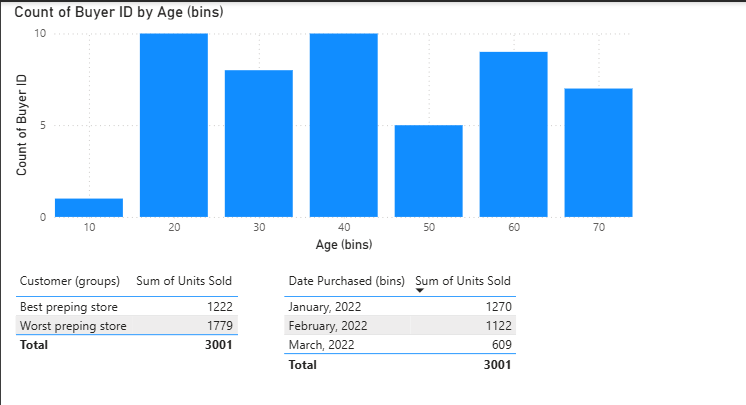

# 06 — Bins and Lists

## What are Bins and Lists?

When you have a continuous numeric column (like Age, Price, or Date), the raw data has too many unique values to group meaningfully in a visual. **Bins and Lists** are Power BI's way of solving this — they let you **manually bucket data into groups** so patterns become visible.

There are two types:

| Type | Best For | How Groups are Defined |
|------|----------|----------------------|
| **Bins** | Numeric or Date columns | Equal-sized automatic ranges (e.g. every 10 years) |
| **Lists** | Text/categorical columns | You manually pick which values go into each group |

Think of Bins like a histogram — you're slicing a continuous range into equal chunks. Think of Lists like custom labels — you're deciding "these three stores = Group A".

---

## Bins — Count of Buyer ID by Age

### What was built

A bar chart showing how many buyers fall into each age range.

| Field | Value |
|-------|-------|
| X-axis | `Age (bins)` — auto-generated bin column |
| Y-axis | `Count of Buyer ID` |
| Bin size | 10 years per bucket |

### How to Create a Bin

1. In the **Fields pane**, right-click a numeric column (e.g. `Age`)
2. Select **New group**
3. In the dialog, set:
   - **Group type** → Bin
   - **Bin size** → e.g. `10` (creates groups: 10, 20, 30, 40...)
4. Click **OK** — a new field `Age (bins)` appears in your Fields pane
5. Drag `Age (bins)` to the X-axis of a bar chart

### Reading the Chart

| Age Bin | Count of Buyers | Insight |
|---------|----------------|---------|
| 10 | ~1 | Very few young buyers |
| 20 | 10 | Highest — most buyers in their 20s |
| 30 | ~8 | Second highest |
| 40 | 10 | Tied for highest |
| 50 | ~5 | Drop off in mid-age |
| 60 | ~9 | Strong recovery |
| 70 | ~7 | Still significant |

> **Key insight:** Buyers peak at ages 20, 40, and 60 — suggesting multiple distinct customer segments rather than one core demographic.

---

## Date Bins — Date Purchased (bins)

Power BI can also bin **dates** automatically into months, quarters, or years.

| Date Bin | Sum of Units Sold |
|----------|------------------|
| January 2022 | 1,270 |
| February 2022 | 1,122 |
| March 2022 | 609 |
| **Total** | **3,001** |

> Sales declined each month — January was the strongest month by units sold.

### How Date Bins Work

When you drag a Date column into a visual, Power BI automatically creates a **date hierarchy** (Year → Quarter → Month → Day). You can:
- Use the drill down arrows to navigate between levels
- Or right-click the date field → **New group** → set bin size to Month, Quarter, etc.

---

## Lists — Customer (groups)

Lists let you group **text/categorical values** into custom named buckets.

| Customer Group | Sum of Units Sold |
|---------------|------------------|
| Best prepping store | 1,222 |
| Worst prepping store | 1,779 |
| **Total** | **3,001** |

### How to Create a List

1. In the **Fields pane**, right-click a text column (e.g. `Customer`)
2. Select **New group**
3. In the dialog, set **Group type → List**
4. Select values from the left panel → click **Group**
5. Rename the group (e.g. "Best prepping store")
6. Repeat for remaining values
7. Click **OK** — a new `Customer (groups)` field appears in the Fields pane

> Unlike Bins (which are automatic), Lists give you **full manual control** over which items belong to which group.

---

## Bins vs Lists — When to Use Which

| Scenario | Use |
|----------|-----|
| Grouping ages, prices, or scores into ranges | **Bins** |
| Grouping months or dates into periods | **Date Bins** |
| Grouping customers, products, or regions into custom categories | **Lists** |
| You want equal-sized automatic buckets | **Bins** |
| You want custom, unequal groupings with your own labels | **Lists** |

---

## Key Takeaways

- [ ] Bins automatically group continuous numeric/date data into equal-sized ranges
- [ ] Lists manually group categorical data into custom named buckets
- [ ] Both create a **new field** in your Fields pane — the original column is untouched
- [ ] Bin size controls granularity — smaller bins = more detail, larger bins = broader view
- [ ] Date columns auto-bin into hierarchies (Year → Quarter → Month → Day)
- [ ] List group names can be renamed to meaningful business labels

---

## Files

| File | Description |
|------|-------------|
| `bins_lists.pbix` | Power BI file with bins and list groupings |
| `screenshots/bins_lists.png` | Screenshot of Age bins chart and grouped tables |
