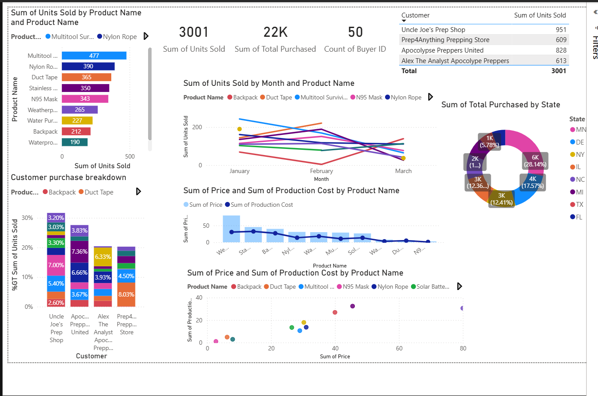

# 06 — Types of Visualizations in Power BI

## Why Does Chart Choice Matter?

Every chart type is designed to answer a **specific kind of question**. Using the wrong chart makes data harder to read, not easier. The golden rule:

> **Match the chart to the question, not to personal preference.**

---

## Visualizations Built

---

## 1. Bar Chart — Sum of Units Sold by Product Name

**Chart type:** Horizontal Bar Chart

| Field | Value |
|-------|-------|
| Y-axis | `Product Name` |
| X-axis | `Sum of Units Sold` |
| Legend | `Product Name` (each product a different color) |

### When to use a Bar Chart
Use a bar chart when you want to **compare a numeric value across categories**.

- Best for: rankings, comparisons, "which is biggest/smallest"
- Works well with: up to ~15 categories
- Horizontal bars are better when category names are long (they fit without rotating)

### Reading this chart
Multitool Survivial Knife (477) leads, followed by Nylon Rope (390) and Duct Tape (365). Waterproof Matches (190) is at the bottom.

---

## 2. Stacked Bar Chart — Customer Purchase Breakdown

**Chart type:** 100% Stacked Bar Chart

| Field | Value |
|-------|-------|
| X-axis | `Customer` |
| Y-axis | `% GT Sum of Units Sold` |
| Legend | `Product Name` |

### When to use a Stacked Bar Chart
Use when you want to show **part-to-whole relationships across multiple categories** simultaneously.

- Best for: "what share of each customer's purchases comes from each product?"
- 100% stacked = all bars reach 100%, so you're comparing proportions not totals
- Regular stacked = bars show actual values, so you can compare both totals and composition

### Reading this chart
Each customer bar is broken into product segments. You can see which products dominate each customer's purchases — e.g. Uncle Joe's Prep Shop has a different product mix than Prep4Anything.

---

## 3. Line Chart — Sum of Units Sold by Month and Product Name

**Chart type:** Line Chart

| Field | Value |
|-------|-------|
| X-axis | `Month` (January, February, March) |
| Y-axis | `Sum of Units Sold` |
| Legend | `Product Name` |

### When to use a Line Chart
Use a line chart when you want to show **trends over time**.

- Best for: time series data, showing rises and falls, spotting trends
- Each line = one category tracked across time
- Crossing lines highlight where rankings changed

### Reading this chart
Multiple product lines are tracked across 3 months. Some products trended up, others dropped sharply by March — visible as crossing lines in the middle of the chart.

---

## 4. Combo Chart — Sum of Price and Production Cost by Product Name

**Chart type:** Line and Clustered Column Chart (Combo Chart)

| Field | Value |
|-------|-------|
| X-axis | `Product Name` |
| Column Y-axis | `Sum of Price` (light blue bars) |
| Line Y-axis | `Sum of Production Cost` (dark blue line) |

### When to use a Combo Chart
Use when you want to **compare two different measures on the same axis** — especially when they have different scales or units.

- Best for: overlaying a trend line on top of bars (e.g. target vs actual, price vs cost)
- The line draws the eye to the trend while bars show absolute values
- Two Y-axes can be used if the measures have very different scales

### Reading this chart
The bars show retail price per product. The flat line shows production cost stays relatively consistent while prices vary — Weatherproof Jacket has the biggest gap between price and cost (highest margin).

---

## 5. Donut Chart — Sum of Total Purchased by State

**Chart type:** Donut Chart

| Field | Value |
|-------|-------|
| Legend | `State` |
| Values | `Sum of Total Purchased` |

### When to use a Donut Chart
Use when you want to show **part-to-whole relationships for a single measure**.

- Best for: showing market share, regional breakdown, category split
- Limit to **5-7 segments** max — too many slices become unreadable
- Donut vs Pie: donut is preferred because the empty center can display a total or KPI

### Reading this chart
NY leads with 28.14% of total purchases, followed by NC (17.57%). MN has the smallest share at 5.78%.

---

## 6. Scatter Plot — Sum of Price vs Sum of Production Cost by Product

**Chart type:** Scatter Chart

| Field | Value |
|-------|-------|
| X-axis | `Sum of Price` |
| Y-axis | `Sum of Production Cost` |
| Legend | `Product Name` |

### When to use a Scatter Plot
Use when you want to show the **relationship (correlation) between two numeric variables**.

- Best for: spotting clusters, outliers, and correlations
- Each dot = one item (product, customer, region)
- Dots far from the cluster = outliers worth investigating

### Reading this chart
Most products cluster in the low price / low cost zone. A few products sit far right (high price) — these are premium items. The spread shows varying margin profiles across products.

---

## 7. Card Visuals — KPI Summary

**Chart type:** Card

| Card | Value |
|------|-------|
| Sum of Units Sold | 3,001 |
| Sum of Total Purchased | 22K |
| Count of Buyer ID | 50 |

### When to use Card Visuals
Use cards to display **single, important numbers** prominently at the top of a dashboard.

- Best for: KPIs, totals, counts, key metrics
- Always place cards at the top — they set context for everything below
- Keep labels short and clear

---

## 8. Table Visual — Customer Units Sold

**Chart type:** Table

| Field | Value |
|-------|-------|
| Rows | `Customer` |
| Values | `Sum of Units Sold` |

### When to use a Table
Use a table when the **exact numbers matter** and visual encoding (bars, lines) would lose precision.

- Best for: detailed breakdowns, exact values, data that will be exported
- Always sort by the key metric column
- Add conditional formatting to make tables more visual (covered in conditional formatting notes)

---

## Chart Selection Guide

| Question you're asking | Best Chart |
|------------------------|-----------|
| Which category is largest? | Bar / Column Chart |
| How has X changed over time? | Line Chart |
| What share does each part contribute? | Donut / Pie / Stacked Bar |
| Is there a relationship between X and Y? | Scatter Plot |
| How do two different measures compare? | Combo Chart |
| What is the single most important number? | Card |
| What are the exact values? | Table |

---

## Key Takeaways

- [ ] Always choose a chart based on the **question** you're answering, not aesthetics
- [ ] Bar charts = comparisons across categories
- [ ] Line charts = trends over time
- [ ] Donut/Stacked bar = part-to-whole relationships
- [ ] Scatter plots = correlations and outlier detection
- [ ] Combo charts = two measures side by side
- [ ] Cards = single KPI numbers at a glance
- [ ] Tables = when exact values matter more than visual patterns

---

## Files

| File | Description |
|------|-------------|
| `visualizations.pbix` | Power BI file with all chart types |
| `screenshots/visualizations.png` | Full dashboard screenshot |
