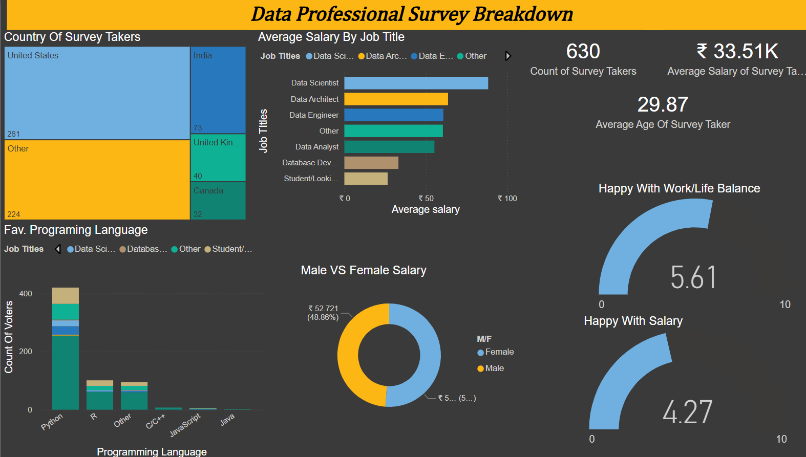

# 07 — Final Project: Data Professional Survey Breakdown

## Project Overview

A complete end-to-end Power BI dashboard built from a real-world survey dataset of data professionals. The dashboard answers key questions about salaries, job satisfaction, demographics, and programming language preferences across different data roles.

This project applies every concept learned across all previous modules — data loading, modeling, DAX measures, and a variety of visualizations — into a single, polished, interactive report.

---

## Dashboard Screenshot

---

## Dataset

**Source:** Data Professional Survey (Alex The Analyst)
**Records:** 630 survey responses from data professionals worldwide

**Key columns used:**

| Column | Description |
|--------|-------------|
| `Q1 - Which Title Best Fits your Current Role` | Job title (Data Scientist, Data Analyst, etc.) |
| `Q5 - Favorite Programming Language` | Python, R, SQL, Java, etc. |
| `Q6 - Average Salary` | Self-reported salary |
| `Q9 - Male/Female` | Gender |
| `Q10 - Current Age` | Age of respondent |
| `Q11 - Which Country do you live in` | Country of residence |
| `Q6 - How Happy are you with your Work/Life Balance` | Satisfaction score (0–10) |
| `Q6 - How Happy are you with your Salary` | Satisfaction score (0–10) |

---

## KPI Cards — Top Center

Three headline numbers displayed as Cards for instant context:

| KPI | Value | What it means |
|-----|-------|---------------|
| Count of Survey Takers | **630** | Total respondents in the dataset |
| Average Salary | **₹ 33.51K** | Mean salary across all roles |
| Average Age | **29.87** | Mean age of survey takers |

> Cards are placed at the top of the dashboard to set context before the reader looks at any chart.

---

## Visuals Breakdown

### 1. Country of Survey Takers — Treemap

Displays geographic distribution of respondents using area size to represent count.

| Country | Count |
|---------|-------|
| United States | 261 (largest block) |
| India | 73 |
| United Kingdom | 40 |
| Canada | ~30 |
| Other | 224 |

**Why a Treemap?** Treemaps are ideal for part-to-whole comparisons across many categories where relative size matters more than exact values. At a glance, it's immediately clear the US dominates the respondent pool.

---

### 2. Average Salary by Job Title — Horizontal Bar Chart

Compares average salary across data roles, color-coded by job title.

| Job Title | Avg Salary |
|-----------|------------|
| Data Scientist | Highest (~₹90K) |
| Data Architect | Second (~₹75K) |
| Data Engineer | Third (~₹65K) |
| Data Analyst | Lower-mid |
| Database Developer | Low |
| Student/Looking | Lowest |

**Why a Horizontal Bar?** Job title names are long — horizontal bars prevent label rotation and keep the chart clean and readable.

---

### 3. Favorite Programming Language — Stacked Bar Chart

Shows programming language preference broken down by job title.

| Field | Value |
|-------|-------|
| X-axis | `Programming Language` (Python, R, Other, C/C++, JavaScript, Java) |
| Y-axis | `Count of Voters` |
| Legend | `Job Title` |

**Key insight:** Python dominates across almost all roles — particularly for Data Scientists and Data Analysts. R is the second choice. JavaScript and Java have very low adoption in the data profession.

---

### 4. Male vs Female Salary — Donut Chart

Compares average salary split between male and female respondents.

| Gender | Share |
|--------|-------|
| Female | 48.86% |
| Male | ~51.14% |

**Why a Donut?** Two-category comparisons work perfectly as donuts — the two segments make the split immediately obvious, and the center can display a key value.

---

### 5. Happy With Work/Life Balance — Gauge Chart

Displays the average satisfaction score for work/life balance on a 0–10 scale.

| Metric | Score |
|--------|-------|
| Work/Life Balance Satisfaction | **5.61 / 10** |

**Why a Gauge?** Gauges communicate "how close are we to the ideal" at a glance. A needle sitting just above the midpoint instantly signals moderate — not great — satisfaction.

---

### 6. Happy With Salary — Gauge Chart

Displays the average satisfaction score for salary on a 0–10 scale.

| Metric | Score |
|--------|-------|
| Salary Satisfaction | **4.27 / 10** |

**Key insight:** Salary satisfaction (4.27) is noticeably lower than work/life balance (5.61) — data professionals are more content with their lifestyle than their compensation.

---

## Key Insights from the Dashboard

1. **Data Scientists earn the most** — significantly ahead of Data Analysts and Database Developers
2. **Python is the dominant language** across all data roles by a wide margin
3. **The average data professional is ~30 years old** — a relatively young field
4. **Salary satisfaction is low (4.27/10)** — even in a well-paying field, professionals feel underpaid
5. **Work/life balance is moderate (5.61/10)** — better than salary satisfaction, but still room to improve
6. **The US accounts for the majority of respondents** — results may skew toward US market conditions

---

## Skills Applied in This Project

| Module | Skill Used |
|--------|-----------|
| 02 Power Query | Cleaned and shaped raw survey data before loading |
| 03 Data Modeling | Single table model with calculated columns |
| 04 DAX | Measures for Average Salary, Average Age, Count of Survey Takers |
| 05 Visualizations | Drill down on stacked bar (Job Title → Language) |
| 06 Advanced Features | Chart type selection tailored to each question |

---

## Files

| File | Description |
|------|-------------|
| `project.pbix` | Full Power BI dashboard file |
| `dataset/survey_data.xlsx` | Raw survey dataset |
| `screenshots/dashboard.png` | Final dashboard screenshot |

---

## What I Learned Building This

- How to work with a real-world survey dataset that needed significant cleaning in Power Query
- How to choose the right chart type for each question the data is answering
- How to design a dashboard layout that tells a story — KPIs first, then detail
- How gauge charts communicate satisfaction scores more intuitively than plain card numbers
- How treemaps handle geographic distribution better than a long bar chart of 50+ countries
